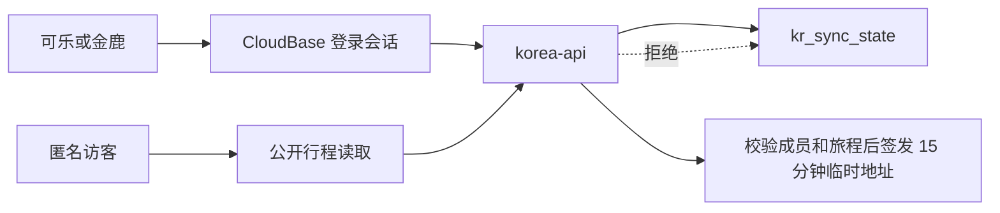

# 在璐上架构与运行手册

更新时间：2026-09-11
对应实现版本：`767b3ab`；前端缓存版本：`lu-travel-v79`

本文描述已经落地的架构和明确未完成的边界，供开发、排障和发布使用。

## 1. 系统组成

| 层 | 实现 | 职责 |
|---|---|---|
| 浏览器应用 | `index.html`、`assets/sync-client.js` | 页面、交互、认证启动、本机缓存与写入队列 |
| 离线壳 | `sw.js` | 缓存非敏感 App 壳和静态素材；不缓存私有文件或动态数据 |
| HTTP 服务 | `cloudfunctions/korea-api/index.js` | 身份校验、访客边界、protocol 2 读写、版本与幂等保护 |
| 数据库 | CloudBase NoSQL `kr_sync_state` | 动态数据权威快照、最近版本与请求回执 |
| 私有文件 | CloudBase Storage `private/…` | 内置凭证与共同附件；当前规则为 PRIVATE |
| 静态发布 | Vercel + CloudBase 静态托管 | 全球/国内访问入口；内容必须保持同版 |

前端是单文件原生 HTML/CSS/JavaScript，不存在构建产物。修改 `index.html` 或 `sw.js` 后需要发布两个静态入口，并递增 Service Worker 缓存版本。

## 2. 身份与访问控制

- 两个共同所有者由服务端根据认证令牌中的 UID 白名单识别；前端用户名和角色字段不具备授权效力。
- 匿名访客只能读取公开总览行程；待办、行李、支出、文件、美食、随笔、灵感、旅程管理以及所有写入均被服务端拒绝。
- 支出和随笔的私有记录带创建者标识，另一位所有者也不能读取、修改或删除。
- 账号密码、访问令牌和私密资料不进入仓库或任何项目文档。

## 3. 同步与冲突处理

每个动态数据集都使用 `tripId` 隔离，并通过 protocol 2 写入：

1. 编辑先写入 IndexedDB 持久队列，再更新当前界面。
2. 客户端带稳定请求 ID 和基础版本提交；重试沿用请求 ID。
3. 服务端将快照不可变分块保存，以事务切换当前版本，并保留有限版本历史与请求回执。
4. 不同逻辑 ID 的并发更改可三方合并；同一逻辑 ID 的真实冲突保留本机版本而不静默覆盖。
5. 启动、回到前台和定时轮询会拉取远端；旧读取不会覆盖此期间的新本机编辑。

当前限制：协议仍按列表快照提交，没有页面内冲突选择器、逐字段同步、通用旅程成员模型或版本浏览/回滚界面。它降低了已知的重复、闪空和乱序风险，但不能替代真实两人双设备弱网验证。客户端只有在远端快照真正显示后才推进编辑基线；保存响应到达期间产生的后续编辑会按记录差量重放，避免抹掉另一设备新加的记录。

## 4. 文件生命周期

### 历史内置 PDF

历史机票、酒店和签证凭证已从公开 `assets/docs/` 移至 CloudBase 私有存储。为兼容已同步的旧记录，前端仅对 7 个已知文件名把废弃的公开地址映射成 `cloud://…/private/korea/visa/…`，再解析临时地址后放入站内 viewer。该迁移防止 Vercel 公开路径 404，且不把敏感资料重新放回静态托管。

已自动回归的链路是：旧 URL 识别 → 私有文件 ID → 已登录浏览器请求临时地址 → PDF iframe 预览。回归使用 CloudBase SDK mock；它不是两名真实所有者获取生产签名链接的替代验证。

### 用户手动上传附件

1. 浏览器先压缩图片或读取允许格式，将内容提交到 `/files/upload`；附件上传要求在线。
2. 后端只允许两个固定所有者，按内容 SHA-256 写入 `private/shared/<tripId>/`，相同内容得到稳定文件 ID。
3. `/docs` 快照只保存文件 ID 和元数据，不再携带 data URL。
4. `/files/url` 同时验证所有者、`tripId` 与文件路径，再签发 15 分钟临时地址；访客与跨旅程请求返回 403。
5. 上传失败时前端保留旧附件；成功上传但记录随后被删除时不会绑定到已不存在的记录。

当前没有自动清理未绑定对象，避免误删仍被历史版本引用的文件。后续应在具备引用扫描和保留期后增加回收任务。

禁止把私有桶改为公开读取，或把私密 PDF 放回 `assets/` 来规避预览问题。

## 5. 灵感收集箱

- `kr_inspirations` 与其他动态数据相同，按 protocol 2 和 `tripId` 同步。
- 仅保存标题、可选地点、归类、来源链接和可选备注。
- 识别小红书与抖音域名，卡片显示来源并在新标签打开原帖/原视频；整卡是主操作，编辑为次要操作。
- 卡片颜色依据稳定记录 ID 选取，跨设备一致；手机端强制单列并裁剪装饰溢出。
- 不读取剪贴板、不自动弹提示、不上传封面截图、不抓取原帖正文、图片或评论。

## 6. 发布与缓存

| 入口 | 用途 | Service Worker scope |
|---|---|---|
| `https://www.jinlu.cloud/` | Vercel 生产入口 | `/` |
| CloudBase 根入口 | 国内静态入口 | `/` |
| CloudBase `/korea/` 镜像 | 国内镜像路径 | `/korea/` |

CloudBase 根入口与 `/korea/` 必须使用各自的 App 壳缓存，不能让根 Worker 接管镜像路径。发布顺序、命令和线上检查见 [HANDOFF_PROMPT.md](./HANDOFF_PROMPT.md)。

## 7. 验证边界

已自动覆盖：静态检查、同步单测、浏览器多 Tab/离线队列/动态数据族回归、访客边界、私有文件路径授权与稳定上传 ID、灵感增改和历史私有文件 URL 迁移、320/390/768/1440 宽度 UI 审查。

尚需人工验证：真实 iPhone/iPad PWA、两位所有者不同设备共同打开真实私有文件、双设备弱网冲突、真实中国大陆/韩国网络、设备清缓存前的待同步提示与恢复演练。
